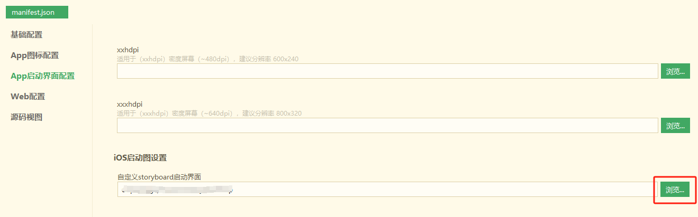

# iOS App配置

## 启动界面 @splashscreen
App启动时，系统加载应用渲染首页需要一定的时间，为了避免用户等待，手机操作系统提供了特殊的启动界面设计，让用户先看到一个简单的界面，等应用加载完成后正式进入应用首页。

这个界面，即被称为启动封面，也成称为 splash。

当然并非所有App都需要splash，很多系统应用比如计算器、日历都没有splash。

uni-app x中，如不配置splash，则与计算器等应用一致，启动时有轻微闪白，但可以让用户更快的使用首页。

如需配置splash，注意避免splash图与首页风格差异太大。因为uni-app x启动速度非常快，splash只是一闪而过，如果颜色差异太大，会让用户视觉不舒服。

> HBuilderX 4.18+ 版本支持配置启动界面
> HBuilderX 4.71 及以上版本Andrid平台可视化界面设置调整到`iOS App配置`项中

uni-app x 的 app-ios 平台，启动界面有以下策略：
- 不配置
- 自定义storyboard启动界面

Storyboard是Apple提供的一种简化的布局界面，通过xml描述界面，不能编程。
虽然无法制作非常灵活的界面，但满足启动界面是没问题的，比如设定背景色背景图、设定前景文字、图片的位置。
storyboard的优势是启动速度快。在App的真实首页被渲染完成前，可以快速给用户提供一个基于Storyboard的启动屏。

### 制作storyboard文件

storyboard有两种制作方式：

**1.** **直接使用[模板文件(点击下载)](https://native-res.dcloud.net.cn/uni-app/file/CustomStoryboard.zip)中提供的相对常用的 storyboard 模板，可在这个文件的基础上进行自定义（不需要 Mac 及 XCode，详情请查看附件中的 readme 教程）**
此 storyboard 文件适用于各种 iPhone 及 iPad 设备的横竖屏，支持自定义界面元素包括

- 页面背景图片或背景颜色
- 中间显示图片
- 底部显示文字及颜色
注：每一项都是可选的（比如只显示背景图片，只提供背景图片即可）

**2.** 使用xcode自行制作。xcode提供了可视化的制作storyboard的方式，但依赖于mac电脑。在xcode中制作storyboard的教程请自行网络搜索，请注意下面的注意事项。

HBuilderX需要的自定义storyboard文件格式为zip压缩包，里面要求包含XCode使用的.storyboard文件，以及.stroybard文件中使用的png图，如下图所示：


::: warning 注意事项
- zip压缩包中不要包含目录，直接包含.storyboard和.png文件
- 有且只有一个.storyboard文件
- .storyboard文件可以通过xcode生成，也可以使用任何文本编辑器修改其源码，比如对.storyboard文件点右键，使用HBuilderX打开。它本质是一个xml文件。
- png文件名称中的@2x和@3x是适配不同分辨率的图片，系统会自动根据设备dpi选择，可参考[这里](https://www.jianshu.com/p/5b5f47ff87d4)
- 为了避免png文件名称与应用中内置的文件名冲突，建议以dc_launchscreen开头
- 制作 storyboard 时，**请将图片资源直接拖到放工程中，不要放到 imageset 里面，并且图片命名要保证一定的唯一性可参考附件中的示例**
- XCode中创建 storyboard 文件时，**页面元素添加约束时一定要相对于** `Superview`，不然启动图到 loading页面过渡时页面会跳动或者变形

:::

### 使用storyboard文件

打开项目的manifest.json文件，在“App启动界面配置”中的“iOS启动图设置”项下选择自己制作的storyboard文件：




## 可选模块配置 @modules

> HBuilderX 4.71 及以上版本支持可视化界面配置可选模块

### uni-location（定位） @modulesLocation

位置服务（定位）使用 [provider机制](../api/provider.md) 实现，包括：[uni.getLocation](../api/get-location.md)，[uni.onLocationChange](../api/location-change.md#onlocationchange)，[uni.offLocationChange](../api/location-change.md#offlocationchange) 等API。

支持以下定位 provider ：

#### 系统定位 @locationSystem
使用系统自带定位功能，由苹果iOS系统实现

#### 腾讯定位 @locationTencent
使用 [腾讯位置服务](https://lbs.qq.com/) 的 “iOS定位SDK” 实现，使用前需申请Key


### uni-map（地图） @modulesMap

#### 腾讯地图 @mapTencent
使用 [腾讯位置服务](https://lbs.qq.com/) 的 “iOS地图SDK” 实现，使用前需申请Key


### uni-payment（支付） @modulesPayment

请求支付使用 [provider机制](../api/provider.md) 实现，包括：[uni.requestPayment](../api/request-payment.md) API。

支持以下支付 provider ：

#### 支付宝支付 @paymentAlipay
使用 “App支付宝客户端SDK” 实现。

#### 微信支付 @paymentWeixin
使用 “微信 Open SDK for iOS” 实现。


## URL Schemes @urlSchemes

> HBuilderX 4.71 及以上版本支持可视化配置URL Schemes。
> HBuilderX 4.71 以下版本未提供 url scheme 配置，需在 app 原生应用配置文件中进行设置，详情参考：[iOS平台 URL Scheme 配置](https://uniapp.dcloud.net.cn/tutorial/app-nativeresource-ios.html#urlscheme)。

打开项目的manifest.json文件，在 “安卓App配置” 的 “URL Schemes” 中设置：
<!--  -->

**注意**
- uni-app x项目标准基座已配置 url scheme 值："uniappx"
- 配置 url scheme 需提交云端打包才能生效

标准基座可通过此网页体验 Url Scheme 启动 App：[https://uniappx.dcloud.net.cn/scheme.html](https://uniappx.dcloud.net.cn/scheme.html)


## 关联域（Associated Domains） @associatedDomains

> HBuilderX 4.71 及以上版本支持可视化配置关联域（Associated Domains）。
> HBuilderX 4.71 以下版本未提供 关联域（Associated Domains）配置，需在 app 原生应用配置文件中进行设置，详情参考：[iOS平台 Associated Domains 配置](https://uniapp.dcloud.net.cn/tutorial/app-nativeresource-ios.html#domains)。

打开项目的manifest.json文件，在 “iOS App配置” 的 “关联域（Associated Domains）” 中设置：
<!--    -->

完整通用链接配置参考：[iOS平台通用链接配置教程](https://uniapp.dcloud.net.cn/tutorial/app-ios-capabilities.html#%E9%80%9A%E7%94%A8%E9%93%BE%E6%8E%A5-universal-link)

**注意**
- uni-app x项目标准基座已配置 universal link 值："https://uniappx.dcloud.net.cn/ulink"，但重签名会使得通用链接配置失效，无法通过通用链接启动标准基座
- 配置 universal link 需提交云端打包才能生效


## 应用访问白名单 @urlschemewhitelist

> HBuilderX 4.71 及以上版本支持可视化配置应用访问白名单。
> HBuilderX 4.71 以下版本未提供应用访问白名单配置，需在 app 原生应用配置文件 [Info.plist](https://uniapp.dcloud.net.cn/tutorial/app-nativeresource-ios.html#infoPlist) 中添加 `LSApplicationQueriesSchemes` 数据。

打开项目的manifest.json文件，在 “iOS App配置” 的 “应用访问白名单” 中设置：
<!--    -->

**注意**
- 配置`应用访问白名单`需提交云端打包才能生效


## 后台运行能力 @backgroundModes

> HBuilderX 4.71 及以上版本支持可视化配置后台运行能力。
> HBuilderX 4.71 以下版本未提供后台运行能力配置，需在 app 原生应用配置文件 [Info.plist](https://uniapp.dcloud.net.cn/tutorial/app-nativeresource-ios.html#infoPlist) 中添加 `UIBackgroundModes` 数据。

打开项目的manifest.json文件，在 “iOS App配置” 的 “应用访问白名单” 中设置：
<!--  -->

**注意**
- 配置`后台运行能力`需提交云端打包才能生效


## 隐私信息访问的许可描述 @usageDescription

> HBuilderX 4.71 及以上版本支持可视化配置隐私信息访问的许可描述。
> HBuilderX 4.71 以下版本未提供隐私信息访问的许可描述配置，需在 app 原生应用配置文件中进行设置，详情参考：[iOS隐私信息访问描述配置](https://uniapp.dcloud.net.cn/tutorial/app-nativeresource-ios.html#usagedescription)。

打开项目的manifest.json文件，在 “iOS App配置” 的 “隐私信息访问的许可描述” 中设置：
<!--  -->

使用[uni内置模块](./manifest-modules.md#utsmodules)时，云端打包回自动添加模块需要的隐私信息访问的许可描述，但许可描述信息是通用描述，不一定适合应用的实际使用场景描述，需根据应用的实际情况配置准确的许可描述。


## CFBundleName @cfbundlename

>HBuilder4.34版本新增支持

iOS平台配置应用内部名称，默认值为“UniAppX”，最多支持15个字符，详细说明参考[苹果官方文档](https://developer.apple.com/documentation/bundleresources/information-property-list/cfbundlename)。
如需更改应用内部名称，可在项目 manifest.json 文件的 "app" -> "distribute" -> "ios" 节点配置 CFBundleName，如下示例将应用内部名称修改为“MyApp”：
```json
{
  "app": {
    "distribute": {
      "ios": {
        "CFBundleName": "MyApp"
      }
    }
  }
}
```


## UIRequiresFullScreen @uirequiresfullscreen

>HBuilder4.34版本新增支持

iOS平台配置应用在iPad设置是否能够与其他应用程序共享屏幕（分屏显示），需配置应用支持iPad设备时有效，默认值为true（可与其他应用程序共享屏幕）。更多信息参考[苹果官方文档](https://developer.apple.com/documentation/bundleresources/information-property-list/uirequiresfullscreen)。
如需更改此配置，可在项目 manifest.json 文件的 "app" -> "distribute" -> "ios" 节点配置 UIRequiresFullScreen，如下示例为配置应用不与其他应用共享屏幕：
```json
{
  "app": {
    "distribute": {
      "ios": {
        "UIRequiresFullScreen": false
      }
    }
  }
}
```
