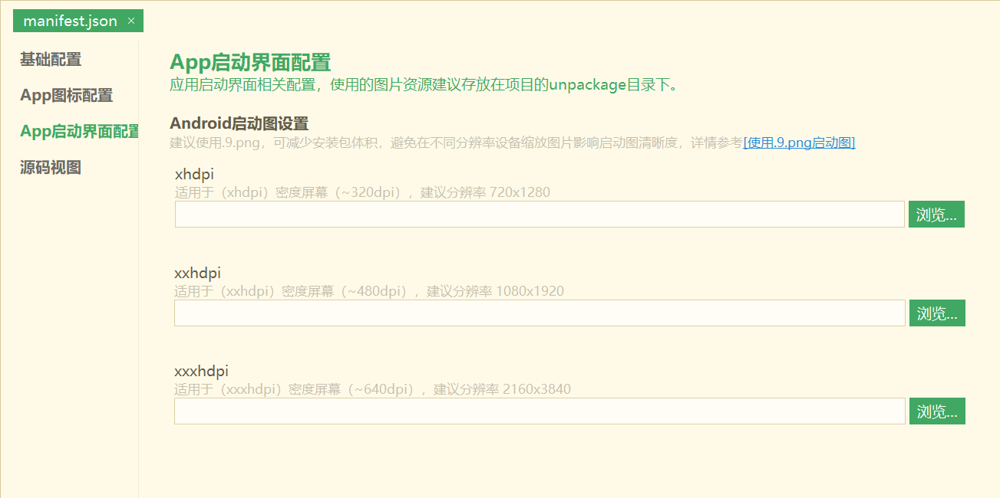
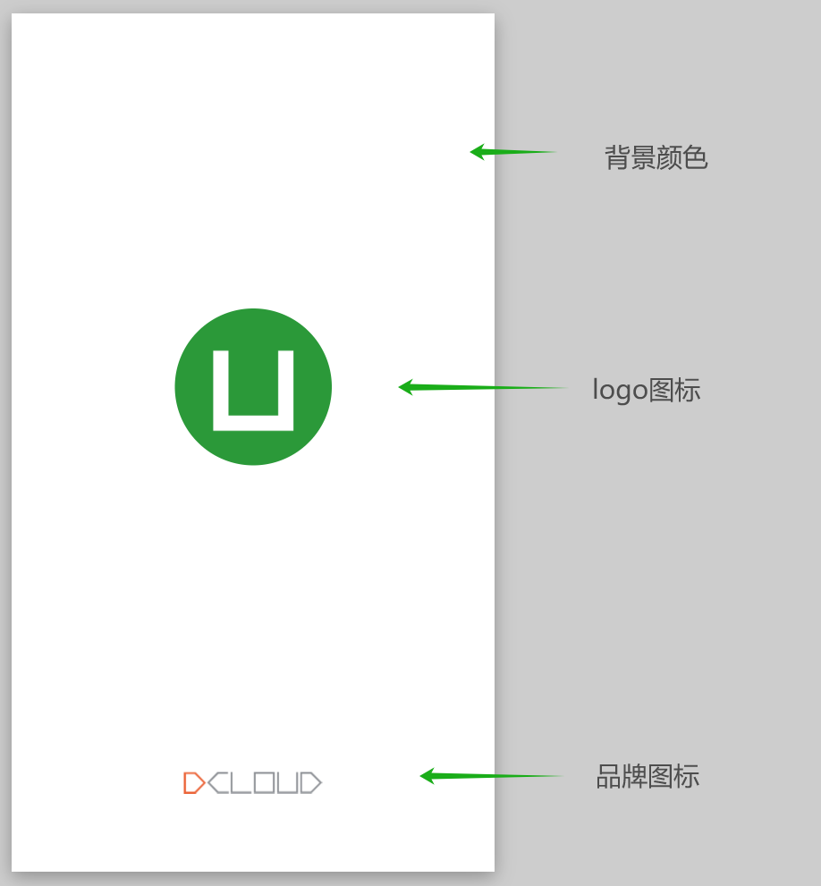
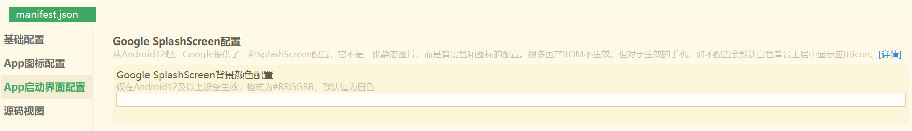
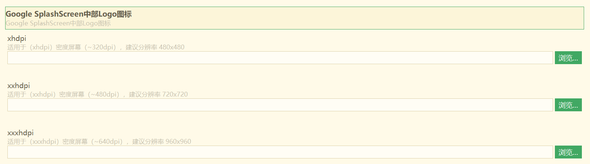
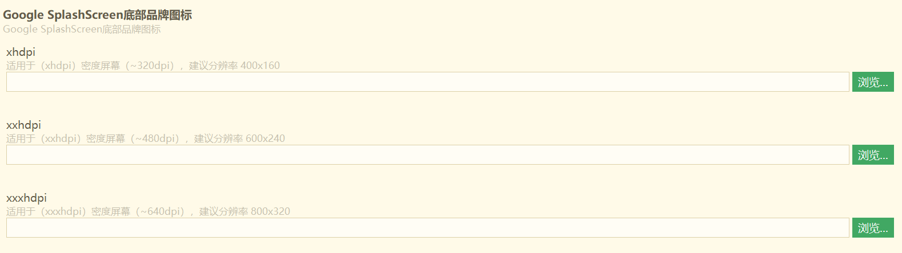

## splash启动封面

> HBuilderX 3.99+

App启动时，系统加载应用渲染首页需要一定的时间，为了避免用户等待，手机操作系统提供了特殊的启动界面设计，让用户先看到一个简单的界面，等应用加载完成后正式进入应用首页。

这个界面，即被称为启动封面，也成称为 splash。

当然并非所有App都需要splash，很多系统应用比如计算器、日历都没有splash。

uni-app x中，如不配置splash，则与计算器等应用一致，启动时有轻微闪白，但可以让用户更快的使用首页。

如需配置splash，注意避免splash图与首页风格差异太大。因为uni-app x启动速度非常快，splash只是一闪而过，如果颜色差异太大，会让用户视觉不舒服。

uni-app x的Android版，启动封面有3种策略：
- 不配置
- 启动图片
- Google SplashScreen

iOS平台目前还不支持splash。

### 启动图配置

项目的manifest.json文件中，在“App启动界面配置”中的“Android启动界面设置”项下配置各设备分辨率启动图：



推荐使用.9.png来适配不同分辨率。

#### .9.png图@9png  

manifest虽然可以定义3种标准分辨率的启动图配置，而实际上存在很多不同分辨率的手机，导致启动图在一些不常见的设备会进行拉伸或压缩引起变形。

为了解决此问题，Google推出了可以适配各种尺寸的一种图片格式“.9.png”。它可以指定特定的区域进行拉伸而不失真。

**使用.9.png的优点**  
1. 避免在非标准分辨率手机上缩放变形  
2. 可以只配置1张或多张图片适配更多分辨率，减少apk的体积（推荐至少配置1080P高分屏启动图片）  

**.9.png图片和普通png图片的差异**  
1. .9.png图片和一般图片的区别在于.9.png图片有四条黑边，而一般的图片没有，这四条黑边就是用来拉伸和指定显示位置的  
2. 使用.9.png图片后，整个图片应该是包裹着你想要显示的内容的，而没有使用的话整个图片将会被拉伸  

**制作.9.png图片**  
1. 在Android sdk目录下的tools目录下，有一个叫做draw9patch.bat的文件，双击打开就可以使用（最新android SDK该文件已经不存在，若电脑没有安装android studio，可下载附件工具编辑.9.png图片）  
2. 使用android studio，因为android studio已经集成.9.png制作工具，只需选中需要生成的png文件，然后右键，点击create 9-patch file 选项  

详细制作步骤可参考链接：[Android中.9图片的含义及制作教程](https://www.jianshu.com/p/3fd048644e3f?tdsourcetag=s_pctim_aiomsg)  

可以使用在线.9.png生成工具：[http://inloop.github.io/shadow4android/](http://inloop.github.io/shadow4android/)  

**.9.png配置使用**  
打开项目的manifest.json文件，在“App启动界面配置”中的“Android启动界面设置”项下，在各分辨率启动图设置框选择需要使用的.9.png图片（图片尺寸请按照提示尺寸对应上传），保存后提交云端打包即可。
> 不同尺寸的启动图是为了适配不同分辨率的手机，所以提交打包时请务必上传不同尺寸的启动图，切忌上传多张同尺寸启动图  

可以参考开发者在[插件市场](https://ext.dcloud.net.cn/search?q=.9)做好的.9样例工程


### Google SplashScreen配置

Android 12（API 31）开始强制开启 [SplashScreen](https://developer.android.google.cn/guide/topics/ui/splash-screen?hl=zh-cn) 。

这个启动界面不是静态图片，而是自定义启动封面的背景颜色、居中logo图标、底部品牌图标。

如果不配置SplashScreen，在Android 12及以上系统的官方Rom和部分三方Rom上，默认会显示白色背景+居中的应用图标，不会显示配置的splash启动图。

但大部分国产Rom默认关闭了这个效果。所以这是一个非常碎片化的问题，在不同的Android版本、不同的Rom上有差异。

海外手机大多支持SplashScreen，而国内手机大多不支持。

在支持的Rom上表现形式如下图，启动后会看到下面的界面，然后直接进入应用主页。



项目的manifest.json文件中，在“App启动界面配置”中的“Google SplashScreen配置”项下，可以配置背景颜色及各设备分辨率的居中logo图标、底部品牌图标。

#### 配置启动界面背景颜色：

可选配置，默认白色



#### 配置启动界面中部logo图标：

可选配置，默认应用启动图标



#### 配置启动界面底部品牌图标：

可选配置，默认底部不显示品牌图标



**Tips**

+ Android启动图设置需提交云端打包后才能生效
+ 配置Android 12应用启动界面后仅影响Android 12及以上版本应用启动界面，Android 12以下版本依然使用启动图展示splash
+ Android 12启动界面中部logo图标在部分系统设备会被裁剪成圆形，部分设备不会裁剪，需要注意圆形logo适配

### 不同Splash方式的选择参考@select

Splash是因为主界面渲染慢，给用户一个等待过渡。但注意复杂的Splash，也一样会影响启动速度。

1. 如不需要splash

不配置启动图，在SplashScreen中配置一个小的白色Logo图。

这样在所有Rom中启动都不会有splash效果。

如果不在SplashScreen配置白色小图，那么在支持SplashScreen的Rom上，启动会在中间渲染App的icon图标。当然这样一个小图也不会占用太多渲染资源。

2. 如需要splash

那么首先需要配置启动图，确保不支持SplashScreen的手机上显示这个启动图。

然后Google SplashScreen配置中配置背景色、居中图标和底图，在支持SplashScreen的手机上，启动封面会变成这个效果。

3. 如只配启动图会怎么样？

在不支持SplashScreen的手机上，会显示启动图；在支持SplashScreen的手机上，不会显示启动图，而是会显示白底背景+居中应用图标。

4. 如只配置SplashScreen会怎么样？

在支持SplashScreen的手机上会显示您的配置。在不支持SplashScreen的手机上会闪白，相当于没有Splash效果。

5. 为什么不能像uni-app js引擎版那样提供一个转圈logo的默认Splash来简化这个事情？

uni-app js引擎版的Android App启动时那个默认的logo转圈效果，其实不是splash，是应用启动后原生view绘制的一个动画。所以点击桌面应用图标后界面不会立即有反应。这个设计影响启动速度，在uni-app x上被废弃了。

### Android平台splash关闭时机@close

splash默认是在首页onShow时关闭。但可配置，打开项目的manifest.json文件，选择源码视图，在app->splashScreen节点下设置autoClose值域，控制splash关闭时机，默认onShow。

**autoClose取值范围:**

|值域		|说明																		|
|--			|--																			|
|onShow	|首页页面生命周期触发onShow时关闭splash	|
|onReady|首页页面生命周期触发onReady时关闭splash|

onReady触发时机要比onShow晚一些。

暂不支持其他方式关闭splash。

配置示例：

```json
"app" : {
    "splashScreen" : {
        "autoClose" : "onReady"
    }
}
```

**注意**

- splash关闭时机中描述的`首页`，指的是第一个真正显示的页面，如项目中pages.json第一个页面A在onLoad生命周期被关闭重新跳转了一个新页面B并显示，则B页面就是`首页`，原因是显示的是页面B，A页面并未显示，
如果是在页面A的onShow或更晚的生命周期关闭在跳转或直接跳转，则页面A是`首页`，因为页面A已经显示符合第一个真正显示的页面。
- splash关闭后才显示开屏广告

### 不同启动方式对splash的影响@starttype

应用的启动有冷启动、温启动、切换到前台，这三种方式splash展示时间是有区别的。

1. 应用冷启动
指首次启动或被kill掉进程后的启动，冷启动时初始化环境，数据加载等会占用一些启动时间，所以splash展示时间长一些。

2. 切换至前台
应用未被关闭，再次启动只是激活到前台，此时不显示splash。

3. 温启动
指应用的activity退出但进程仍未被手机系统回收。此时启动，由于不会再初始化环境，加载数据等操作，所以相对启动时间较少，splash展示时间也会缩短。

由于uni-app x默认在app.uvue里使用了uni.exit，这种退出方式只关闭了activity，没有关闭应用进程。如果rom没有回收掉App进程时再启动该App，就会触发温启动。此时splash会一闪而过。

当然App如何退出是开发者自己定义的。很多Android App直接单击back隐藏在后台，不弹toast询问用户是否退出。此时也可以避免温启动的splash快闪。这种方式的开发详见[切换应用到后台](../api/exit.md#back)。

