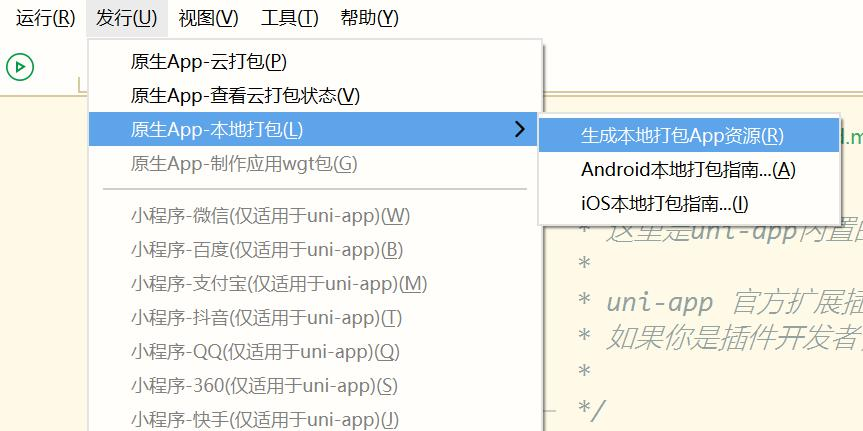
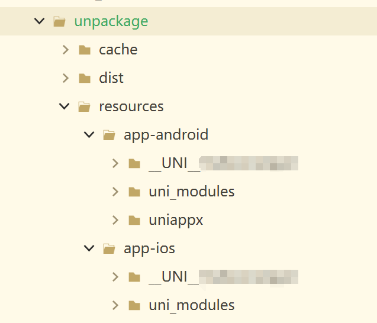

### 生成离线打包app资源
#### 通过 HBuilderX 可视化界面创建的项目
选择项目，然后点击：发行 -> 原生App-本地打包 -> 生成本地打包App资源

导出成功之后会在项目的unpackage/resources目录下生成资源文件

目录说明：
- `app-android` 对应的是android原生代码及资源文件
	- `appid` android导出的资源文件
	- `uniappx` 导出的android原生kotlin文件
	- `uni_modules` 导出的uts原生插件
- `app-ios` 对应的是android原生代码及资源文件
	- `appid` ios导出的资源文件
	- `uni_modules` 导出的uts原生插件

***
注意：
- uni-app x导出的资源文件android和ios不互通！
***

### 导入Android项目

[将资源导入Android原生项目](../use/android.md)