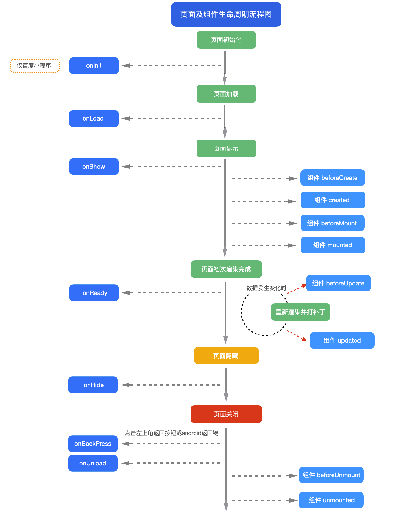

# 页面简介

本文未包括页面生命周期的详细介绍，需另见 [页面](https://uniapp.dcloud.net.cn/tutorial/page.html)

## 页面生命周期 @lifecycle

<!-- PAGEINSTANCE.lifeCycle.compatibility -->

示例代码, [详见](./vue/README.md#lifecycle-options)

### 页面onLoad生命周期 @onload

页面初始化时，会触发onLoad生命周期。此时Dom还未构建渲染完毕（需要等onReady）。

所以onLoad页面常见的用途是开始联网取数，由于联网是异步的，在onLoad发起联网，等到获取到服务器数据后，也就可以更新到data上了。

页面的URL支持参数传递，这个参数也是在onLoad生命周期中获取。

通过uni.navigateTo API 或 `<navigator>`组件，可跳转到目标页面，比如从list页面跳转到detail页面，如下：

```uts
// 发起跳转，并传入post_id参数
uni.navigateTo({
  url: '/pages/template/list-news/detail/detail?post_id=' + post_id
})
```

```uts
// 在detail页面的onLoad中接收URL中传递的参数
export default {
  data() {
    return {
      post_id: ""
    }
  },
  onLoad(event : OnLoadOptions) { // 类型非必填，可自动推导
    this.post_id = event["post_id"] ?? "";
    // 可根据详情页id继续联网请求数据...
  },
}
```

::: warning 注意
- OnLoadOptions类型，可不填。不填时可自动推导。
- OnLoadOptions类型目前在web和Android的运行时类型不统一，web是对象，Android是map。[详见issues](https://issues.dcloud.net.cn/pages/issues/detail?id=967)
  - 但仍然可以通过上述示例代码跨平台的获取入参。
  - 后续版本会统一类型为UTSJSONObject。
:::


## 页面及组件生命周期流程图 @lifecycleflow

#{.zooming width=1000 margin=auto}
